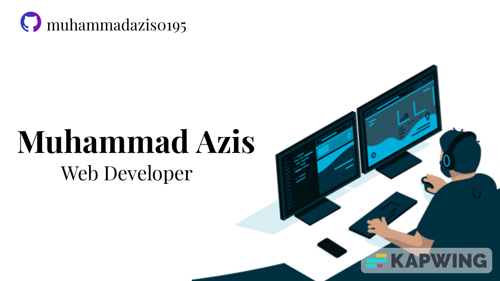

### Hi there 👋

<!--
**muhammadazis0195/muhammadazis0195** is a ✨ _special_ ✨ repository because its `README.md` (this file) appears on your GitHub profile.

Here are some ideas to get you started:

- 🔭 I’m currently working on ...
- 🌱 I’m currently learning ...
- 👯 I’m looking to collaborate on ...
- 🤔 I’m looking for help with ...
- 💬 Ask me about ...
- 📫 How to reach me: ...
- 😄 Pronouns: ...
- ⚡ Fun fact: ...
-->

# HELLO I AM MUHAMMAD AZIS  
## I AM WEB DEVELOPER

<code></code>
<code></code>
<code></code>
<code></code>
<code></code>
<code></code>

 

 

Currently focused on learning in JavaScript, but exposed in all aspects of web development including front and back end, version management with git. I do programming fulltime, I always keep to learn deep into the fundamentals of the languages and moving forward into web development with the latest technologies required to work with it.

### my favorite tools

* [HTML & CSS](https://html.com/) - the fundamental tool for building the website
* [JavaScript](https://www.javascript.com/) - the magic tool for the dynamic web
* [BOOTSTRAP](https://getbootstrap.com/) - the amazing tool for building layouts

  

